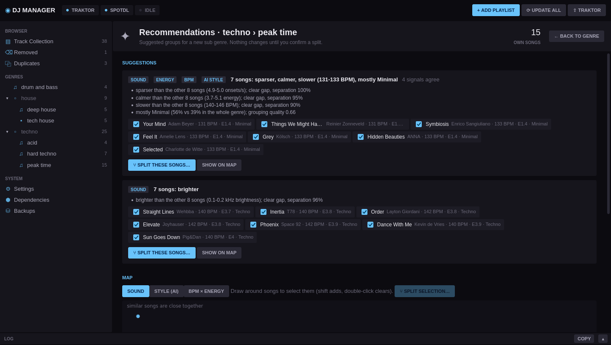
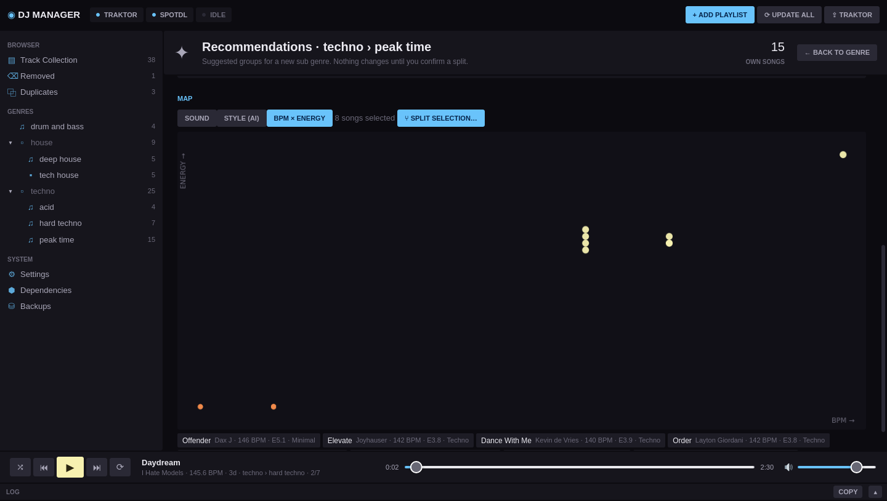
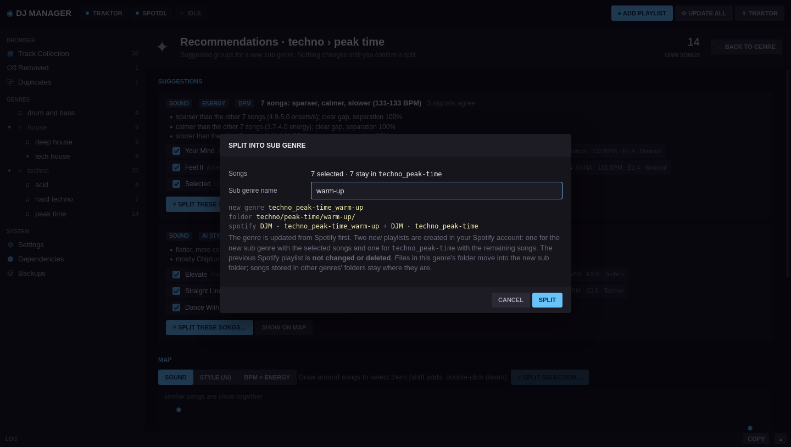

# DJ Manager

Single source of truth for a genre-based music collection. Spotify playlists (via
[spotdl](https://github.com/spotDL/spotify-downloader)) are the discovery tool, folders on
disk store every song once, and Traktor gets generated playlists for every genre layer.


The spec is in `requirements.txt`.

## Install

Download the file for your system from the latest GitHub release:

| File | System | Notes |
|---|---|---|
| `DJManager-<version>-setup.exe` | Windows 10/11 (x64) | **Recommended.** Installs per user (no admin rights), adds Start menu entries, updates itself |
| `DJManager-<version>-portable.exe` | Windows 10/11 (x64) | Single file, no installation. Keeps its data in `DJManager-data\` next to the exe |
| `dj-manager-<version>-linux-x86_64` | Linux x86_64 (glibc 2.35+, e.g. Ubuntu 22.04+) | Single file. `chmod +x` it and run; the UI opens in your browser |

Nothing else needs to be installed. The first time you install spotdl from the
Dependencies page, the packaged app downloads its own Python runtime (about 30 MB) and
creates spotdl's environment from it.

The Windows app shows its UI in a native window. That needs the Microsoft Edge WebView2
runtime, which Windows 10/11 normally include. Without it, the app falls back to the browser.

### Run from source

Requires Python 3.10+ (Windows or Linux).

```bash
python -m venv .venv
.venv/bin/pip install -e ".[window]"      # Windows: .venv\Scripts\pip install -e ".[window]"
.venv/bin/dj-manager                     # native window (pywebview)
.venv/bin/dj-manager --browser           # or in the browser
```

On Linux pywebview needs a GUI backend (`pip install "pywebview[qt]"` or the GTK packages of
your distribution). Without one, DJ Manager opens the browser instead.

First start:
1. **Dependencies** → *Install spotdl + yt-dlp*, then *Download ffmpeg via spotdl*.
2. **Settings** → select the main music folder. Existing folders are imported as genres.
   The Traktor `collection.nml` is auto-detected (Windows `Documents/Native Instruments/Traktor x.y.z`,
   Linux: Wine prefixes `~/.wine`, `~/.local/share/wineprefixes/*`, `~/Games/*`) or can be selected.
3. Optional, needed for splitting genres and for your private playlists: connect your Spotify
   account (see below). Public playlists work without any login.

Close Traktor whenever DJ Manager writes the collection. DJ Manager checks for a running
Traktor and refuses to write while it is open.

## Concepts

| Term | Meaning |
|---|---|
| Genre key | `techno_hard-techno`: `_` separates layers, `-` stands for a space. Folder: `techno/hard-techno/` |
| Playlist | One genre node, optionally linked to a Spotify playlist. 1 playlist = 1 genre |
| Traktor | Folder `DJ Manager` with nested genre folders. Every genre has a playlist that includes all its sub genres |
| `LOCAL` | Track in a linked playlist that is not part of the Spotify playlist (imported or kept after a link change) |
| Blacklist | Songs removed manually from a playlist. They are not added again by the next update |
| Removed | Tracks that are in no genre anymore. They are never deleted; delete the file yourself and they disappear |
| Duplicates | Copies of the same song found during import. The library uses one file; the others can be moved to the trash (see below) |
| Split | Selected songs of a genre become a new sub genre, with new Spotify playlists for both |
| Analysis | BPM and key of every song, computed by DJ Manager (stoppable, resumes where it stopped) |
| Recommendations | Optional suggestions which songs of a genre could form a new sub genre |

Songs are identified by the Spotify URL that spotdl embeds, then by ISRC, then by
artist + title (± 3 s duration).

**Removing a playlist** deletes its Traktor playlist and folder. Files still used by other
playlists move into one of their folders, and the rest move to `<music>/_removed/<key>/`.
Moves are applied to the Traktor collection entries, so cue points and beat grids survive.

## Cleaning up duplicates

Songs that exist several times on disk (e.g. downloaded into several playlist folders before)
are stored once in the library: every genre where a copy was found contains the song, and
Traktor's genre playlists point to one file. The **Duplicates** view shows, per song, which
file is kept and which copies can go. This is the only place where DJ Manager removes files.

- **Certain duplicates** - same Spotify id or ISRC in the tags, or an identical file - are
  moved to the trash with one button.
- **Maybe duplicates** - only artist and title match, the duration may differ - could be
  another version (Original vs Extended Mix). They are only removed when you tick them.
- The kept copy is the one with cue points or a beatgrid in Traktor, otherwise the best audio
  quality (lossless, then bitrate).
- Copies go to the system trash (Recycle Bin), never deleted permanently. Before each one the
  kept file is checked, and a copy that is the kept file itself (hard link, symlink, different
  case on Windows) is never removed.
- Afterwards every genre still contains the song; where the file lives in another genre's
  folder it is marked **IN OTHER GENRE**. Traktor references to removed copies, also in your
  own playlists, point to the kept file. Playlist updates recognise the song and do not
  download it again. Close Traktor before cleaning up.

## Splitting genres

When a genre grows too big, select the songs that belong together (click, ctrl, shift)
and press **SPLIT**. Enter the name of the new sub genre, e.g. `speed garage` in
`house_ukg-garage`. Only songs of the genre's own playlist can be selected; songs of
existing sub genres are split from there.

1. The genre is updated from Spotify first, so recently added songs are included.
2. A new Spotify playlist `DJM · house_ukg-garage_speed-garage` is created with
   the selected songs.
3. A new Spotify playlist `DJM · house_ukg-garage` is created with the remaining
   songs. **The previous playlist is not changed or deleted.** DJ Manager never deletes
   Spotify playlists.
4. Both genres are linked to their new playlists.
5. Files in the genre's folder move into the new sub folder
   (`house/ukg-garage/speed-garage/`), and the Traktor collection follows the moves.
   Songs that are stored in another genre's folder stay there, and their other genres are
   not affected. Songs without a Spotify id move along as `LOCAL`.

DJ Manager asks Spotify to create the playlists as non-public, but Spotify has long ignored
that for playlists created through the API, so they may show up on your profile. Make them
private in the Spotify app if you want to hide them.

Creating Spotify playlists is also available for genres without a link
(**+ SPOTIFY PLAYLIST**, with all songs of the genre) and in *Add playlist* (a new, empty
Spotify playlist). The name prefix can be changed in Settings.

### Connect your Spotify account

Spotify only allows creating playlists through your own Spotify app. Since February 2026
such apps run in Development Mode, the app owner needs **Spotify Premium**, and an app can
have up to 5 users.

1. Open [developer.spotify.com/dashboard](https://developer.spotify.com/dashboard) and
   create an app. Add the redirect URI `http://127.0.0.1:9900/` and select **Web API**.
2. Copy the app's **Client ID** into Settings → Spotify → Client ID. A client secret is
   not needed (DJ Manager logs in with PKCE).
3. Press **CONNECT SPOTIFY ACCOUNT** and log in in the browser window that opens.

This is the only login in DJ Manager. Playlists of the connected account are read through
the official Web API, which also works for private playlists. Other people's public
playlists are read by spotdl, which needs no login. (Since February 2026 Spotify only lets
apps read the songs of playlists you own or collaborate on, so a login would not help spotdl
with other people's private playlists either.)

## Player

The bar at the bottom plays songs right in DJ Manager: double-click a song (or the ▶ on its
row number) to play the list from there, or press **▶ PLAY** above a list to play all of it,
in the order and with the search filter shown. Controls: play/pause (also the space bar),
back (restarts the song, a second press goes to the previous one), skip, shuffle and loop
(off / whole list / this song); seek on the progress bar, set the volume. Keyboard media keys
work too. Songs without a file are skipped. Formats the window cannot play (e.g. AIFF in
some browsers) are skipped with a message.

## Ratings, BPM and key

Track lists show the **rating** (stars from the file's tags, e.g. what Traktor or other
players wrote; Traktor's collection fills in for files without one), plus **BPM** and
**key** from DJ Manager's own analysis. Columns are sortable; keys are shown in Open Key
(like Traktor), Camelot or musical notation (Settings → Analysis).

The analysis uses [Essentia](https://essentia.upf.edu/) on Linux and
[librosa](https://librosa.org/) on Windows (Essentia has no Windows build). The tool is
installed into the managed environment the first time it is needed, with a snapshot
like every other dependency change. Songs are decoded with spotdl's ffmpeg and analysed by
several worker processes in parallel.

It starts automatically for
- new downloads,
- the songs found when a music folder is imported,
- songs that appear in the music folder outside DJ Manager (found at startup and with
  *Rescan*).

The top bar shows its progress next to other tasks. **Stop** pauses it and keeps every
finished result. A paused analysis does not restart by itself; **Resume** (top bar or
Settings → Analysis) continues with the songs that are left. Settings → Analysis can also
retry failed songs or analyse everything again, and sets the BPM range (results outside
are halved or doubled), the key notation and the number of parallel workers. Results are
stored in DJ Manager only; Traktor keeps its own analysis.

## Split recommendations (optional)

Off by default. Enable it under Settings → Split recommendations; every genre then gets a
**✦ RECOMMEND** button. It shows groups of the genre's own songs that could become a new
sub genre, and a map to pick groups yourself. A suggestion never changes anything: it only
pre-fills the split dialog, which you confirm as usual.

| Signal | What it finds | Extra analysis per 6-min song |
|---|---|---|
| BPM groups | A clear gap or a wide tempo range (e.g. 124-128 vs 138-142 BPM) | none |
| Energy level 1-10 | Warm-up vs peak-time tracks (loudness, onset density, brightness) | ~2 s, with sound |
| Sound similarity | Groups that are e.g. brighter, busier or bass-heavier than the rest | (same pass) |
| AI styles | Groups with a typical style, named after it (400 Discogs styles, e.g. "Speed Garage") | ~3-4 s |

Each signal can be switched on separately, and analysed either automatically for new songs
(default for energy/sound) or only on request (default for AI styles). *Analyse collection
now* fills in songs that were added before. The analyses run in the analysis lane and can be
stopped and resumed like the BPM/key analysis.

How suggestions are made:
- BPM and energy: the best two-way split of the values; suggested when the two groups differ
  clearly (4 BPM / 1.5 energy points) and both are large enough (Settings: smallest group).
- Sound: a split along one property (e.g. brightness) is only suggested if it is sharper than
  what random data reaches in 99% of cases, so a uniform genre gets no suggestion. Groups
  that differ in a combination of properties are found by clustering.
- AI styles: songs are grouped by their style embedding; the group is named after the style
  that is most over-represented in it.
- If several signals find the same songs, they form one suggestion listing every reason.

The map shows the songs by BPM × energy, by sound or by style (similar songs close
together). Draw around songs to select them (shift adds, double-click clears) and split
the selection.

The AI styles use the Discogs-EffNet model by the [Music Technology Group](https://essentia.upf.edu/models.html)
(CC BY-NC-ND 4.0, free for non-commercial use), run with onnxruntime. DJ Manager computes
the model's input itself, identical to Essentia's (verified against essentia-tensorflow),
so the styles are the same on Linux and Windows. onnxruntime and the model (about 35 MB)
are downloaded the first time the AI styles are analysed. Style labels of single songs are
not always right; grouping by style similarity is more reliable than single labels.

## Screenshots

The screenshots use a demo library of generated test tones, which is why the AI style
recognition calls some of them "Chiptune" or "Minimal". They are created with
`packaging/screenshots.py` (see *Building and releasing*).

**Genre with sub genres.** A genre's playlist contains every track of its sub genres. The
*Playlists* column shows which playlist(s) a track belongs to; each file is still stored
only once on disk.


**Add a playlist.** The name defines the genre path. The preview shows the folder that
will be created and the Traktor playlists it ends up in.


**Blacklist.** Songs you removed by hand stay out, even though they are still in the
Spotify playlist. Unblock them to get them back on the next update.


**Split recommendations** (optional). Groups that several signals agree on, with the reasons
and the songs to keep or drop; the map shows the genre by BPM × energy, sound or style, and
groups can be lassoed. *Split these songs* pre-fills the split dialog.







**Duplicates.** Which copy of each song is kept and which go to the trash; uncertain matches
are listed separately to tick.


**Settings** for the music folder, Traktor, Spotify login, download format and updates.


**Dependencies.** Update spotdl and yt-dlp from the app; every change is snapshotted and
can be restored.


## Data locations

| What | Linux | Windows |
|---|---|---|
| Library state | `<music>/.djmanager/library.json` | same |
| Settings | `~/.config/dj-manager/settings.json` | `%APPDATA%\DJManager` |
| spotdl environment, snapshots, Traktor backups | `~/.local/share/dj-manager/` | `%LOCALAPPDATA%\DJManager` |

The portable Windows exe keeps settings and data in `DJManager-data\` next to the exe.
Set `DJMANAGER_HOME` to keep settings and data in a single folder of your choice.
Windowed builds write their log to `<data>/logs/dj-manager.log`.

## Dependency updates

spotdl and yt-dlp run in their own virtual environment and can be updated from the UI
(latest or any version from PyPI). Before every change the full `pip freeze` is
snapshotted, and any snapshot can be restored. After a successful playlist update, the
current snapshot is marked as known good.

## App updates

DJ Manager checks the latest GitHub release when it starts (Settings → Updates can turn
that off or check manually). When a newer version exists, an **UPDATE TO x.y.z** button
appears in the top bar. Every download is checked against the release's `SHA256SUMS.txt`
before anything is replaced.

| Installation | How the update is applied |
|---|---|
| Installer | Downloads the new `setup.exe` and runs it silently over the existing installation, then DJ Manager starts again |
| Portable exe | Renames the running exe to `.old.exe`, puts the new one in its place and restarts (the old file is removed on the next start) |
| Linux binary | Replaces the binary in place and restarts |
| Source checkout | Shows the new version; update with `git pull` |

Your library, settings, backups and spotdl environment are not touched by updates.
The release source is the GitHub repository the build came from. To use a different one,
set Settings → Updates → *Release source* (`owner/repo`).

## Building and releasing

Build for the platform you are on (PyInstaller cannot cross-compile):

```bash
pip install -e ".[build]"            # Windows: add ,window → ".[window,build]"
python packaging/build.py --repo owner/repo
```

| Platform | Output in `dist/` | Requirements |
|---|---|---|
| Linux | `dj-manager-<v>-linux-x86_64` | build on the oldest distro you want to support (glibc) |
| Windows | `DJManager-<v>-portable.exe`, `DJManager-<v>-setup.exe` | [Inno Setup 6](https://jrsoftware.org/isinfo.php) for the installer; `--skip-installer` builds only the portable exe |

`--repo` sets which GitHub repository the updater checks. The installer script is
`packaging/windows/installer.iss`. Never change its `AppId`: it is what lets new versions
install over old ones.

**Release:** first retake the README screenshots so they show the new version:

```bash
python packaging/screenshots.py --analysis-python ~/.local/share/dj-manager/deps/venv/bin/python \
    --models ~/.local/share/dj-manager/deps/models    # models: only needed for the AI styles
```

It builds a demo library, runs DJ Manager from source with the real analysis and captures
every view with headless Firefox (needs `selenium` and `firefox`). Check the images, commit
them, then bump `__version__` in `djmanager/__init__.py`, commit, and

```bash
git tag v0.2.0 && git push origin main v0.2.0
```

`.github/workflows/release.yml` runs the tests, checks that the tag matches the version,
builds all three files on GitHub's Windows and Ubuntu 22.04 runners, and publishes them
with `SHA256SUMS.txt` as a release. Installed copies pick the release up on their next start.

## Development

```bash
.venv/bin/pip install -e ".[dev]"
.venv/bin/pytest
```

Layout: `djmanager/` contains `genres` (naming), `library` (model and persistence), `scanner`
(initial import), `audio` (tags), `spotdl_client`, `deps` (managed environment), `traktor`
(NML), `backup`, `spotify_api` (Web API, PKCE login), `analysis` (BPM/key, energy, sound and style workers), `recommend` (split suggestions), `procs` (stoppable child processes), `updater` (self-update), `service` (operations as background jobs), `api` (FastAPI)
and `static/` (UI). `packaging/` holds the build script, PyInstaller launcher, icon and installer.
