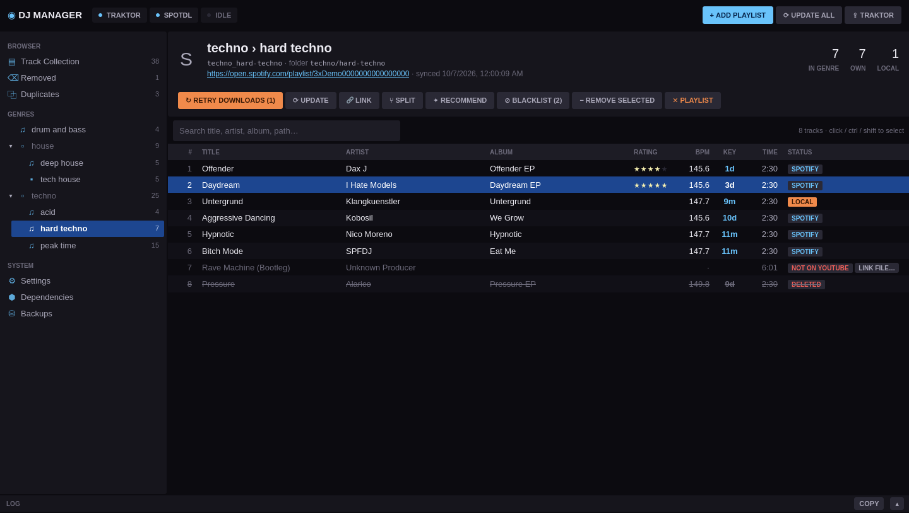
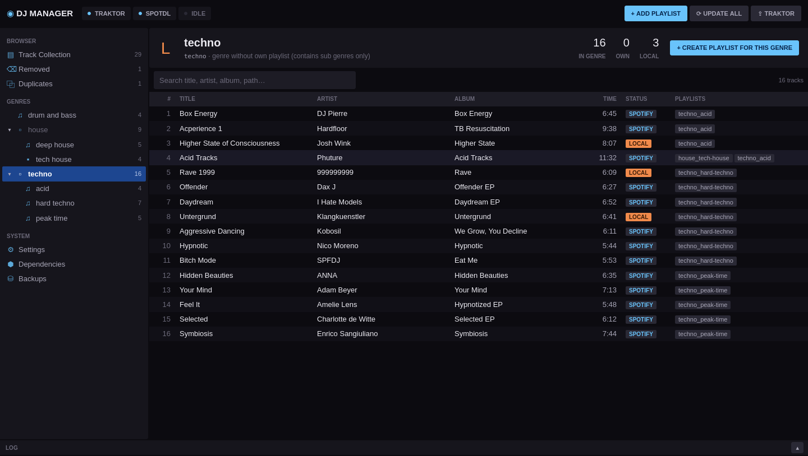
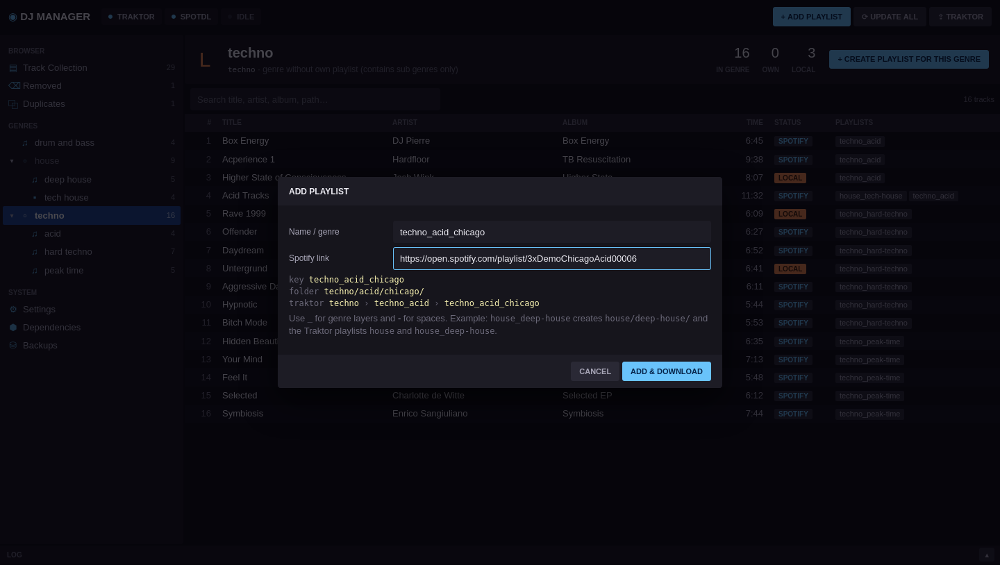
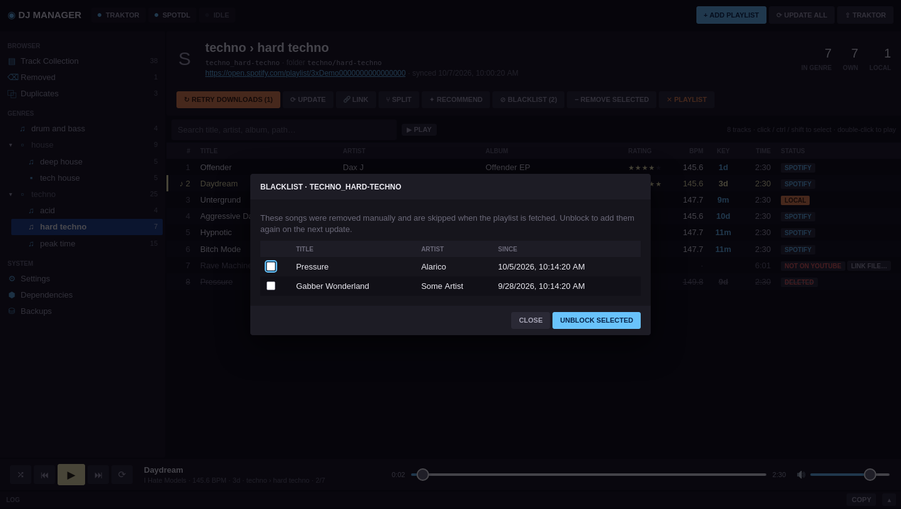
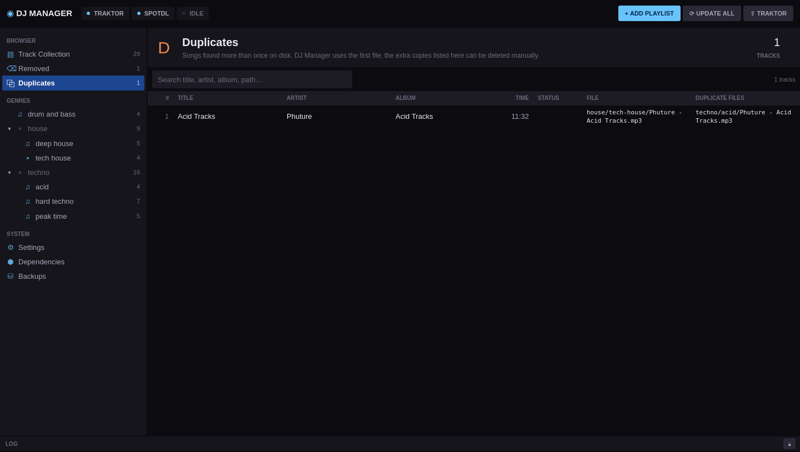
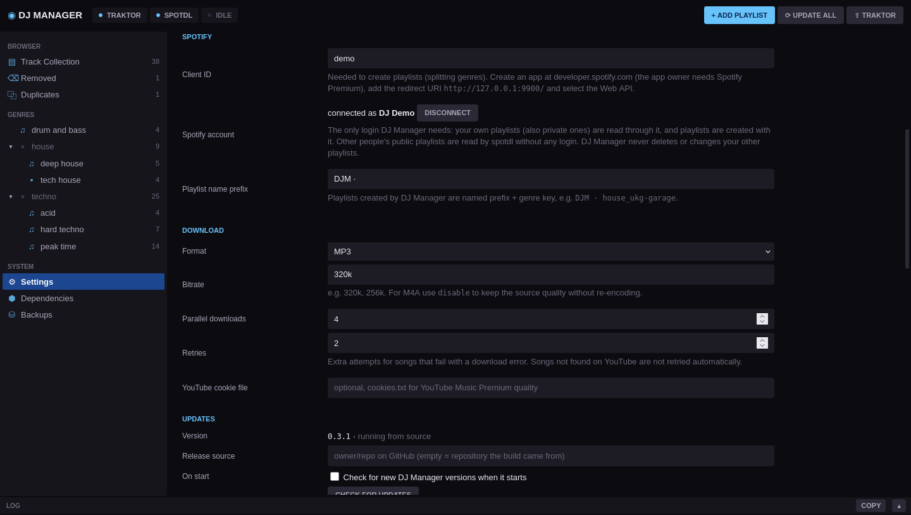
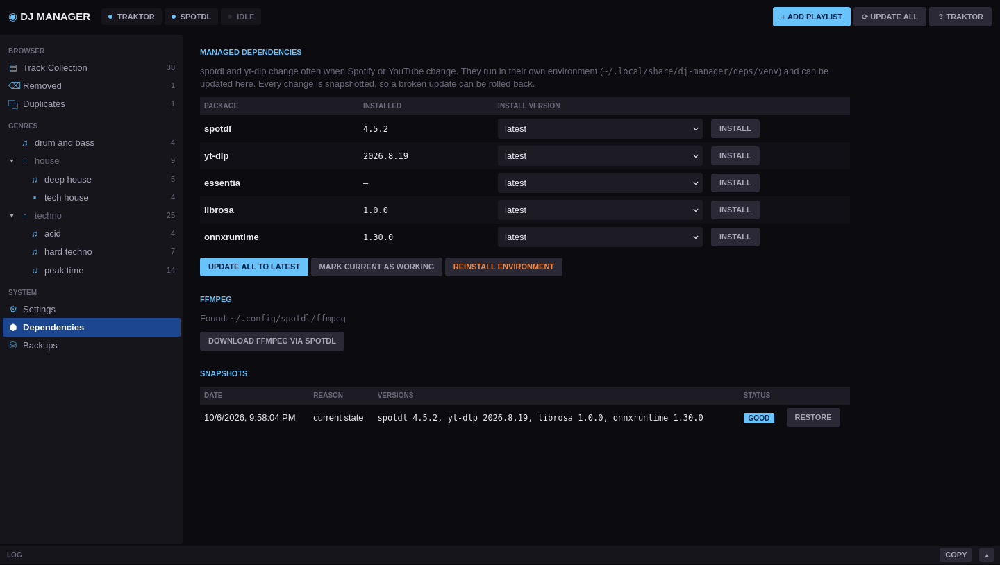

# DJ Manager

Single source of truth for a genre-based music collection. Spotify playlists (via
[spotdl](https://github.com/spotDL/spotify-downloader)) are the discovery tool, folders on
disk store every song once, and Traktor gets generated playlists for every genre layer.



The spec is in `requirements.txt`.

## Install

Download the file for your system from the latest GitHub release:

| File | System | Notes |
|---|---|---|
| `DJManager-<version>-setup.exe` | Windows 10/11 (x64) | **Recommended.** Installs per user (no admin rights), adds Start menu entries, updates itself |
| `DJManager-<version>-portable.exe` | Windows 10/11 (x64) | Single file, no installation. Keeps its data in `DJManager-data\` next to the exe |
| `dj-manager-<version>-linux-x86_64` | Linux x86_64 (glibc 2.35+, e.g. Ubuntu 22.04+) | Single file. `chmod +x` it and run; the UI opens in your browser |

Nothing else needs to be installed. The first time you install spotdl from the
Dependencies page, the packaged app downloads its own Python runtime (about 30 MB) and
creates spotdl's environment from it.

The Windows app shows its UI in a native window. That needs the Microsoft Edge WebView2
runtime, which Windows 10/11 normally include. Without it, the app falls back to the browser.

### Run from source

Requires Python 3.10+ (Windows or Linux).

```bash
python -m venv .venv
.venv/bin/pip install -e ".[window]"      # Windows: .venv\Scripts\pip install -e ".[window]"
.venv/bin/dj-manager                     # native window (pywebview)
.venv/bin/dj-manager --browser           # or in the browser
```

On Linux pywebview needs a GUI backend (`pip install "pywebview[qt]"` or the GTK packages of
your distribution). Without one, DJ Manager opens the browser instead.

First start:
1. **Dependencies** → *Install spotdl + yt-dlp*, then *Download ffmpeg via spotdl*.
2. **Settings** → select the main music folder. Existing folders are imported as genres.
   The Traktor `collection.nml` is auto-detected (Windows `Documents/Native Instruments/Traktor x.y.z`,
   Linux: Wine prefixes `~/.wine`, `~/.local/share/wineprefixes/*`, `~/Games/*`) or can be selected.
3. Optional, needed for splitting genres: connect your Spotify account (see below).

Close Traktor whenever DJ Manager writes the collection. DJ Manager checks for a running
Traktor and refuses to write while it is open.

## Concepts

| Term | Meaning |
|---|---|
| Genre key | `techno_hard-techno`: `_` separates layers, `-` stands for a space. Folder: `techno/hard-techno/` |
| Playlist | One genre node, optionally linked to a Spotify playlist. 1 playlist = 1 genre |
| Traktor | Folder `DJ Manager` with nested genre folders. Every genre has a playlist that includes all its sub genres |
| `LOCAL` | Track in a linked playlist that is not part of the Spotify playlist (imported or kept after a link change) |
| Blacklist | Songs removed manually from a playlist. They are not added again by the next update |
| Removed | Tracks that are in no genre anymore. They are never deleted; delete the file yourself and they disappear |
| Duplicates | Copies of the same song found during import. The first file found is used and the others are listed |
| Split | Selected songs of a genre become a new sub genre, with new Spotify playlists for both |

Songs are identified by the Spotify URL that spotdl embeds, then by ISRC, then by
artist + title (± 3 s duration).

**Removing a playlist** deletes its Traktor playlist and folder. Files still used by other
playlists move into one of their folders, and the rest move to `<music>/_removed/<key>/`.
Moves are applied to the Traktor collection entries, so cue points and beat grids survive.

## Splitting genres

When a genre grows too big, select the songs that belong together (click, ctrl, shift)
and press **SPLIT**. Enter the name of the new sub genre, e.g. `speed garage` in
`house_ukg-garage`. Only songs of the genre's own playlist can be selected; songs of
existing sub genres are split from there.

1. The genre is updated from Spotify first, so recently added songs are included.
2. A new private Spotify playlist `DJM · house_ukg-garage_speed-garage` is created with
   the selected songs.
3. A new private Spotify playlist `DJM · house_ukg-garage` is created with the remaining
   songs. **The previous playlist is not changed or deleted.** DJ Manager never deletes
   Spotify playlists.
4. Both genres are linked to their new playlists.
5. Files in the genre's folder move into the new sub folder
   (`house/ukg-garage/speed-garage/`), and the Traktor collection follows the moves.
   Songs that are stored in another genre's folder stay there, and their other genres are
   not affected. Songs without a Spotify id move along as `LOCAL`.

Creating Spotify playlists is also available for genres without a link
(**+ SPOTIFY PLAYLIST**, with all songs of the genre) and in *Add playlist* (a new, empty
Spotify playlist). The name prefix can be changed in Settings.

### Connect your Spotify account

Spotify only allows creating playlists through your own Spotify app. Since February 2026
such apps run in Development Mode, the app owner needs **Spotify Premium**, and an app can
have up to 5 users.

1. Open [developer.spotify.com/dashboard](https://developer.spotify.com/dashboard) and
   create an app. Add the redirect URI `http://127.0.0.1:9900/` and select **Web API**.
2. Copy the app's **Client ID** into Settings → Spotify → Client ID. A client secret is
   not needed for this (DJ Manager logs in with PKCE).
3. Press **CONNECT SPOTIFY ACCOUNT** and log in in the browser window that opens.

Playlists of the connected account are then read through the official Web API, which also
works for private playlists. Other people's playlists are still read with spotdl.

## Screenshots

**Genre with sub genres.** A genre's playlist contains every track of its sub genres. The
*Playlists* column shows which playlist(s) a track belongs to; each file is still stored
only once on disk.



**Add a playlist.** The name defines the genre path. The preview shows the folder that
will be created and the Traktor playlists it ends up in.



**Blacklist.** Songs you removed by hand stay out, even though they are still in the
Spotify playlist. Unblock them to get them back on the next update.



**Duplicates.** Copies of the same song found during the import. DJ Manager uses one file;
the others are listed so you can delete them.



**Settings** for the music folder, Traktor, Spotify login, download format and updates.



**Dependencies.** Update spotdl and yt-dlp from the app; every change is snapshotted and
can be restored.



## Data locations

| What | Linux | Windows |
|---|---|---|
| Library state | `<music>/.djmanager/library.json` | same |
| Settings | `~/.config/dj-manager/settings.json` | `%APPDATA%\DJManager` |
| spotdl environment, snapshots, Traktor backups | `~/.local/share/dj-manager/` | `%LOCALAPPDATA%\DJManager` |

The portable Windows exe keeps settings and data in `DJManager-data\` next to the exe.
Set `DJMANAGER_HOME` to keep settings and data in a single folder of your choice.
Windowed builds write their log to `<data>/logs/dj-manager.log`.

## Dependency updates

spotdl and yt-dlp run in their own virtual environment and can be updated from the UI
(latest or any version from PyPI). Before every change the full `pip freeze` is
snapshotted, and any snapshot can be restored. After a successful playlist update, the
current snapshot is marked as known good.

## App updates

DJ Manager checks the latest GitHub release when it starts (Settings → Updates can turn
that off or check manually). When a newer version exists, an **UPDATE TO x.y.z** button
appears in the top bar. Every download is checked against the release's `SHA256SUMS.txt`
before anything is replaced.

| Installation | How the update is applied |
|---|---|
| Installer | Downloads the new `setup.exe` and runs it silently over the existing installation, then DJ Manager starts again |
| Portable exe | Renames the running exe to `.old.exe`, puts the new one in its place and restarts (the old file is removed on the next start) |
| Linux binary | Replaces the binary in place and restarts |
| Source checkout | Shows the new version; update with `git pull` |

Your library, settings, backups and spotdl environment are not touched by updates.
The release source is the GitHub repository the build came from. To use a different one,
set Settings → Updates → *Release source* (`owner/repo`).

## Building and releasing

Build for the platform you are on (PyInstaller cannot cross-compile):

```bash
pip install -e ".[build]"            # Windows: add ,window → ".[window,build]"
python packaging/build.py --repo owner/repo
```

| Platform | Output in `dist/` | Requirements |
|---|---|---|
| Linux | `dj-manager-<v>-linux-x86_64` | build on the oldest distro you want to support (glibc) |
| Windows | `DJManager-<v>-portable.exe`, `DJManager-<v>-setup.exe` | [Inno Setup 6](https://jrsoftware.org/isinfo.php) for the installer; `--skip-installer` builds only the portable exe |

`--repo` sets which GitHub repository the updater checks. The installer script is
`packaging/windows/installer.iss`. Never change its `AppId`: it is what lets new versions
install over old ones.

**Release:** bump `__version__` in `djmanager/__init__.py`, commit, then

```bash
git tag v0.2.0 && git push origin main v0.2.0
```

`.github/workflows/release.yml` runs the tests, checks that the tag matches the version,
builds all three files on GitHub's Windows and Ubuntu 22.04 runners, and publishes them
with `SHA256SUMS.txt` as a release. Installed copies pick the release up on their next start.

## Development

```bash
.venv/bin/pip install -e ".[dev]"
.venv/bin/pytest
```

Layout: `djmanager/` contains `genres` (naming), `library` (model and persistence), `scanner`
(initial import), `audio` (tags), `spotdl_client`, `deps` (managed environment), `traktor`
(NML), `backup`, `spotify_api` (Web API, PKCE login), `procs` (stoppable child processes), `updater` (self-update), `service` (operations as background jobs), `api` (FastAPI)
and `static/` (UI). `packaging/` holds the build script, PyInstaller launcher, icon and installer.
